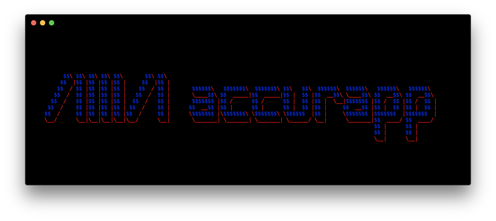

## 

**Accurapp** is a project kickstarter customized for the specific needs of [Accurat](http://accurat.it/).

It was originally forked from [create-react-app](https://github.com/facebookincubator/create-react-app/),
but significant amounts of code were rewritten and simplified. Here are some shiny features:

- **ESLint** config based on [StandardJS](https://standardjs.com/) with some opinionated customizations, also with addition of a lot of React rules. [See all the rules here](https://github.com/accurat/accurapp/blob/master/packages/eslint-config-accurapp/index.js).
- **Babel** preset based on the supported browsers with the addition of the [stage-0](https://babeljs.io/docs/plugins/preset-stage-0/) preset and the [macros](https://github.com/kentcdodds/babel-plugin-macros) plugin. Node_modules are transpiled also.
- Possibility to define your custom **supported browsers** (both for dev and prod) in the `browserslist` field of `package.json`. This will affect the Babel transpilation and the CSS Autoprefixing.
- **GLSL webpack loader** to import shaders and require shaders within shaders.
- **CSV webpack loader** to import .csv files as an array of JSONs.
- **React SVG loader** to import .svg files as react components, useful for icons. Svgs get also optimized with [svgo](https://github.com/svg/svgo).
- **CSS Modules** support in files that end with `*.module.css`. [Read more about CSS Modules here](https://github.com/css-modules/css-modules).
- **Web Worker** bundling support in files that end with `*.worker.js` using the [worker-loader](https://github.com/webpack-contrib/worker-loader).
- **CSS postprocessing** using postcss to enable [Autoprefixing](https://github.com/postcss/autoprefixer) and [CSS Nesting](https://github.com/postcss/postcss-nested).
- **JSON5 webpack loader** to import .json5 files. [Read more about JSON5 here](https://json5.org/).

## Table of contents
- [Creating a new project](#creating-a-new-project)
- [Customization](#customization)
  - [Customizing Webpack](#customizing-webpack)
  - [Customizing Eslint](#customizing-eslint)
  - [Customizing Babel](#customizing-babel)
  - [Setting Env Variables](#setting-env-variables)
  - [Customizing Env Variables](#customizing-env-variables)
- [Available Env Variables](#available-env-variables)
- [Project Scaffolding](#project-scaffolding)
- [F.A.Q.](#faq)
  - [How do I enable hot reloading for the state?](#faq)
  - [Where do I put the images?](#faq)
  - [Where do I put the custom fonts?](#faq)
  - [What is the public folder for?](#faq)
  - [How do I handle svg files?](#faq)
  - [How do I enable TypeScript?](#faq)
  - [How do I override a webpack loader?](#faq)
  - [What's all the fuss about FUSS?](#faq)
  - [How do I enable prettier?](#faq)
  - [I need to support IE11. What do I do?](#faq)
  - [How do I use a web worker?](#faq)
  - [How do I use a service worker?](#faq)
  - [I need title and meta tags for each route for SEO. How do I do it?](#faq)
  - [I need to build for Electron. How do I do it?](#faq)
- [Contributing](#contributing)

## Creating a new project
Having installed node (`brew install node`), run this command in the directory where you want to create the `project-name` folder. This command will also handle the project scaffolding, the dependencies installation, and the git initialization with a first commit.
```sh
npx create-accurapp project-name
```

> **Note**: if it says `npx: command not found` update your node version by running `brew upgrade node`

> **Note:** If your project fails to start right after installing, npx may be using a cached version of `create-accurapp`.
> Remove previously installed versions with `npm uninstall -g create-accurapp`

Then you just `cd project-name`, run `yarn start` and start creating awesome stuff! 🎉

#### Setting up github
1. Create a new repo - [link](https://github.com/organizations/accurat/repositories/new)
1. Leave it empty, and follow the instructions displayed

#### Setting up the automatic deploy
1. Login into [netlify.com](https://app.netlify.com/)
1. Click `New site from Git`
1. Click `Github` and select the repo you created from the list
1. Select `accurat` from the team list
1. Create the project
1. Go into `Site settings` and click `Change site name` to update the generated url with a more appropriate one
1. Go into `Build & deploy` > `Edit Settings` and select `Branch deploys: All` if you want to deploy every branch
1. To enable **slack notifications**
  1. First you have to get the incoming webhook url pinned in the #dev channel on slack
  1. Then you have to paste it in `Build & deploy` > `Deploy notifications` > `Slack` > `Deploy succeeded`
1. Deploy site!

#### Commands
These are the available commands once you created a project:
- `yarn start` starts a server locally, accessible both from your browser and from another machine using your same wi-fi
- `yarn start --exposed` starts a server locally and exposes it to the internet, accessible from everyone having the link, kinda like ngrok, but works only if you have an accurat ssh key. The link created looks like `{branch}.{repo}.internal.accurat.io` if you're in a branch, or `{repo}.internal.accurat.io` if you're on master. It uses a server with an instance of [SSH-Tuna](https://github.com/accurat/ssh-tuna) to achieve this.
- `yarn build` builds the project for production, ready to be deployed from the `build/` folder
- `yarn test` runs [jest](https://jestjs.io/en/). By default (if you're not in a CI) it runs in watch mode, but you can disable watch mode by passing `--watch=false`. You can also pass any other argument you would pass to jest, for example `yarn test --updateSnapshot` updates your snapshots.
- `yarn lint` lints with eslint the `src/` folder. You can pass any [eslint options](https://eslint.org/docs/user-guide/command-line-interface#options) to the lint command, for example if you want to use eslint's fix option, you do it like this:
```json
"lint-fix": "accurapp-scripts lint --fix",
```
- `yarn prettier` prettifies all the code in the `src/` folder, overwriting the files. You can pass options also to this command, for example if you want to print only the files which would be prettified but don't overwrite them:
```json
"prettier-check": "accurapp-scripts prettier --list-different",
```

**NOTE**: you need to have at least Node v10 and yarn v1.2.1, make sure you have the correct versions if you run into some problems running these commands. You can check their version by running `node -v` and `yarn -v`.

## Customization
#### Customizing Webpack
You can pass a custom webpack config to the `buildWebpackConfig` function in the project's `webpack.config.js`.
```js
const { buildWebpackConfig } = require('webpack-preset-accurapp')

module.exports = buildWebpackConfig({
  target: 'node',
})
```

Or to make your life easier, you could also use [webpack-blocks](https://github.com/andywer/webpack-blocks/tree/release/release-2.0), it's a nice level of abstraction over the webpack configuration, you can add loaders, plugins, configuration with few lines. For example, this is the way to add sass.
```js
const { buildWebpackConfig, cssOptions, postcssOptions } = require('webpack-preset-accurapp')
const { match } = require('@webpack-blocks/webpack')
const { css } = require('@webpack-blocks/assets')
const postcss = require('@webpack-blocks/postcss')
const sass = require('@webpack-blocks/sass')

module.exports = buildWebpackConfig([
  match(['*.scss'], [css(cssOptions), postcss(postcssOptions), sass()]),
])
```

For example, this is the way to customize the webpack-dev-server options.
```js
const { buildWebpackConfig } = require('webpack-preset-accurapp')
const { env, devServer } = require('webpack-blocks')

module.exports = buildWebpackConfig([
  env('development', [
    devServer({
      // your custom options here
    }),
  ]),
])
```

Or this is a way to add a custom loader.
```js
const { buildWebpackConfig } = require('webpack-preset-accurapp')

function customLoader() {
  return (context, { addLoader }) => addLoader({
    test: /\.extension\.js$/,
    loader: 'custom-loader',
  })
}

module.exports = buildWebpackConfig([
  customLoader(),
])
```

And this is a way to add a custom plugin.
```js
const { buildWebpackConfig } = require('webpack-preset-accurapp')
const { addPlugins } = require('webpack-blocks')
const NpmInstallPlugin = require('npm-install-webpack-plugin')

module.exports = buildWebpackConfig([
  addPlugins([
    new NpmInstallPlugin(),
  ]),
])
```

Also you can still pass a custom webpack config using webpack-blocks.
```js
const { buildWebpackConfig } = require('webpack-preset-accurapp')
const { customConfig } = require('webpack-blocks')

module.exports = buildWebpackConfig([
  // ...other blocks
  customConfig({
    target: 'node',
  }),
])
```

#### Customizing Eslint
Add your custom rules to the `.eslintrc`
```js
{
  "extends": "eslint-config-accurapp",
  "rules": {
    "no-shadow": "off"
  }
}
```

#### Customizing Babel
Add your custom presets/plugins to the `.babelrc`
```js
{
  "presets": ["accurapp"],
  "plugins": [
    ["lodash", { "id": ["lodash", "recompose"] }]
  ]
}
```

#### Setting Env Variables
All the Env Variables are automatically injected into the application (if used), no need to use webpack's `DefinePlugin`.

You can define your variables in those different places, **in order of importance** (1 will override 2 and 2 will override 3):

1. in the `package.json`'s scripts section:
```json
  "start": "HTTPS=true accurapp-scripts start",
```
1. in the CI config script:
```yml
  script:
    - GENERATE_SOURCEMAP=true yarn build
```
1. in the `.env` file:
```
SECRET=djah7s9ihdias7hdsaodhoas8hd
```

Use as:
```js
const endpoint = process.env.SERVER || www.example.com
```

**NOTE**: if you don't wish to have too many variables in the scripts section, you could also use a combo of the `.env.example` during CI and the `.env` file in local. If the `process.env.CI` is true, `.env.example` is used instead of `.env`.

#### Customizing Env Variables
Here are the available Env Variables for the **yarn start** script:
- **BROWSER** - If it should open local url in the browser in `yarn start` (default `true`)
- **HOST** - The host of the web server (default `localhost`)
- **PORT** - The port of the web server (default `8000`)
- **HTTPS** - Set this to `true` if you wish to use HTTPS in development (default `false`)
- **CI** - Set this to true to skip the check for newer accurapp versions (default `false`)

Here are instead the available Env Variables for the **yarn build** script:
- **PUBLIC_URL** - Use this if the application is hosted on a subpath, it will be used to resolve assets (default `/`).
Here are some examples of its usage:
```html
<link rel="shortcut icon" href="%PUBLIC_URL%/favicon.ico">
```
```js
render() {
  return ;
}
```

- **GENERATE_SOURCEMAP** - Use this if you want to generate the external sourcemaps files (default `false`)

- **TRANSPILE_NODE_MODULES** - Set this to false if you want to disable the babel transpilation of the `node_modules` (default `true`)

- **WATCH_NODE_MODULES** - Set this to true if you want to recompile when any of the used `node_modules` changes (default `false`)

- **TUNNEL_DOMAIN** - The domain that the command `yarn start --exposed` will use as a request tunnel, it must be the domain of a server with an instance of [SSH-Tuna](https://github.com/accurat/ssh-tuna) on it (default `internal.accurat.io`)

## Available Env Variables
These are the Env Variables that Accurapp provides you, you cannot modify them directly:
- **NODE_ENV** - It is equal to `'development'` in the `yarn start` command and `'production'` in the `yarn build` command
- **LATEST_TAG** - The latest git tag you made, useful if you want to display a build version in your application
- **LATEST_COMMIT** - The latest commit hash, useful if you want to display a more specific build version
- **LATEST_COMMIT_TIMESTAMP** - The UTC timestamp of the latest commit, you can use it like this:

```js
new Date(Number(process.env.LATEST_COMMIT_TIMESTAMP))
```

- **BROWSERSLIST** - It is built from the `browserslist` field in the `package.json`


## Project Scaffolding
```
├── build             # created when you run yarn build
├── public            # put the static stuff here
│   └── favicon.ico
├── src
│   ├── components
│   │   └── App.js
│   ├── lib           # put here the utils functions reusable in other projects
│   │   └── README
│   ├── reset.css
│   ├── style.css
│   ├── index.html
│   └── index.js
├── .babelrc
├── .env.example
├── .eslintrc
├── .gitignore
├── .prettierignore
├── .prettierrc
├── jest.config.js
├── netlify.toml
├── package.json
├── README.md
├── webpack.config.js
└── yarn.lock
```

## F.A.Q.

<details>
<summary>How do I enable hot reloading for the state?</summary>

By default, hot reloading is enabled for the react components tree in accurapp, but if you want to hot-reload also the [mobx-state-tree](https://github.com/mobxjs/mobx-state-tree) files, your `index.js` should look like this:
```js
let state = State.create()

function renderApp() {
  ReactDOM.render(
    <MobxProvider state={state}>
      <App/>
    </MobxProvider>,
    document.getElementById('root'),
  )
}

// First render
renderApp()

// Hot module reloading
if (module.hot) {
  // Some component changed, rerender the app
  // and let the react-diffing handle the changes
  module.hot.accept('components/App', () => {
    console.clear()
    renderApp()
  })

  // Store definition changed, recreate a new one from old state and rerender
  module.hot.accept('state', () => {
    state = State.create(getSnapshot(state))
    console.clear()
    renderApp()
  })
}
```
The first argument to `module.hot.accept` must be the root component of the app, often the `Routes` component is used.
</details>

<details>
<summary>Where do I put the images?</summary>

You can put them in the `src/images` folder and require them from the js like this:
```js
import logo from '../images/logo.png'

console.log(logo) // /logo.84287d09.png

function Header() {
  // Import result is the URL of your image
  return 
}
```

or from the CSS (see [css-loader](https://github.com/webpack-contrib/css-loader) for more info):
```css
.Logo {
  background-image: url(~images/logo.png);
}
```
The advantage is that it creates a hash in the filename to invalidate eventual caching. Another thing is that images that are less than 10,000 bytes are imported as a [data URI](https://developer.mozilla.org/en-US/docs/Web/HTTP/Basics_of_HTTP/Data_URIs) instead of a path, to reduce the number of requests to the server.

Also you could tell webpack to automatically optimize the images you import with the [imagemin-webpack-plugin](https://github.com/Klathmon/imagemin-webpack-plugin).
</details>

<details>
<summary>Where do I put the custom fonts?</summary>

You can put them in the `src/fonts` folder and require them from the CSS like this (see [css-loader](https://github.com/webpack-contrib/css-loader) for more info):

```css
@font-face {
  font-family: 'Helvetica Neue';
  src: url('~fonts/HelveticaNeue-Thin.ttf') format('truetype');
  font-weight: 200;
}
```
</details>

<details>
<summary>What is the `public` folder for?</summary>

You usually put the assets you require from the `index.html` here. Like for example the favicon.

If you need a service worker file just for making the app work offline, use the [offline-plugin](https://github.com/NekR/offline-plugin). An alternative is the [workbox-webpack-plugin](https://developers.google.com/web/tools/workbox/modules/workbox-webpack-plugin).

You should normally import stylesheets, images and fonts in JavaScript files using the Module System because this mechanism provides a number of benefits.

The `public` folder is a useful workaround that gives you access from browsers to a file, outside the Module System. If you put a file into the public folder, it will not be processed by Webpack. Instead it will be copied into the build folder untouched.

Be careful because with this approach files are not post-processed or minified and first of all, if lost, they will cause 404 errors.

For technical in-depth analysis read the create-react-app [documentation].(https://facebook.github.io/create-react-app/docs/using-the-public-folder)

</details>

<details>
<summary>How do I handle svg files?</summary>

By default you can import svgs as files, like you would do for images:
```js
import logo from '../images/logo.svg'

console.log(logo) // /logo.84287d09.svg

function Header() {
  // Import result is the URL of your svg
  return 
}
```

But if the svg is an icon, and you need to apply some styles to it, you can also import it as a react component, and pass it some `className` or `style` props:
```js
import { ReactComponent as PencilIcon } from '../icons/pencil.svg'

// It's like doing
// function PencilIcon(props) {
//   return (
//     <svg viewBox="..." {...props}>
//       ...
//     </svg>
//   )
// }

function Edit() {
  // .db displays the svg as a block, removing the little space
  // underneath that the default inline-block svg has
  //
  // .w1 sets the dimensions, you can also set the dimensions
  // in px using the style attribute
  //
  // .black colors the icon black, like you would do with text
  return <PencilIcon className="db w1 black" />
}
```
Under the hood, the loader basically wraps the svg file inside a react component, so you can treat it as such.

This strips the svg file from its original styles, because it inherits the style from the color you give it through `fill="currentColor"`. If you want to keep the colors instead, call the svg like this: `pencil.colors.svg`.

Furthermore it optimizes and minifies the svg using [svgo](https://github.com/svg/svgo), so it cleans up automatically the ugly and noisy svg that Illustrator exports 🙌.
</details>

<details>
<summary>How do I enable TypeScript?</summary>

TypesScript is not enabled by default in accurapp, to bootstrap a project with typescript you will have to run:


```sh
npx create-accurapp project-name --typescript
```

> **Note:** If your project fails to start right after installing, npx may be using a cached version of `create-accurapp`.
> Remove previously installed versions with `npm uninstall -g create-accurapp`

Otherwise, if you have an existing javascript project and want to switch to typescript, you will just have to rename the `index.js` to `index.tsx`. On the next `yarn start`, typescript will be installed as a dependency, a `tsconfig.json` and a `types.d.ts` will be created, and you will be able to do your magic in typescript! 🧙‍♂️

Here is how a basic typescript component should look like:

```ts
interface Props {}
interface State {}

export class App extends React.Component<Props, State> {
  state = {}

  render() {
    return <div>...</div>
  }
}
```

See the [Typescript JSX guide](https://www.typescriptlang.org/docs/handbook/jsx.html) for more info.

> **Note**: Constant enums and namespaces are not supported.

</details>

<details>
<summary>How do I override a webpack loader?</summary>

The easiest way to override a loader is to do it inline, by prefixing the import with a `!`.

For example:

```js
import csvString from '!raw-loader!../data/some_data.csv'
```
This will override the default `csv-loader` for that file.

[See the related docs](https://webpack.js.org/concepts/loaders/#inline).

Make sure to disable the related eslint rule like this:
```js
{
  "extends": "eslint-config-accurapp",
  "rules": {
    "import/no-webpack-loader-syntax": "off"
  }
}
```
</details>

<details>
<summary>What's all the fuss about FUSS?</summary>

Accurapp comes with [postcss-fuss](https://github.com/marcofugaro/postcss-fuss/tree/function-updates), a postcss plugin that lets you generate custom functional css classes, in the [tachyons](https://raw.githubusercontent.com/tachyons-css/tachyons/master/css/tachyons.css) way. It's useful if you want to define custom colors, and don't want to write all the classes by hand. And for many other stuff.

For example, this is what you write in your `style.css`:

```css
@fuss color(tomato, #ff6347);
```

And this is what the generated css looks like:

```css
.tomato { color: #ff6347 }
.bg-tomato { background-color: #ff6347 }
.b--tomato { border-color: #ff6347 }
```

There are other preset functions, like `color-variants()` which outputs both a lighter and darker version of the color, `color-states()` which outputs the classes in the hover active and focus pseudo-classes. You can even create your own custom modifier function!

[More info in the postcss-fuss readme.](https://github.com/marcofugaro/postcss-fuss/tree/function-updates)
</details>

<details>
<summary>How do I enable prettier?</summary>

Prettier is already configured in the projects scaffolded by accurapp, you just need to install the prettier plugin in your editor of choice and tell it to read the project's configuration.

You should also configure prettier to run on save, it is really useful especially when you paste code from stackoverflow.
</details>

<details>
<summary>I need to support IE11. What do I do?</summary>

First of all, we're sorry for you, IE is an asshole.

You first need to edit the `package.json`'s `"browserslist"` field, and change `not ie 11` to `ie 11`. If you need to test in local you can also add `ie 11` to the development browsers.

You will now have to provide polyfills for the newer apis you're using, for example [the fetch polyfill](https://github.com/github/fetch), or the [css variables ponyfill](https://github.com/jhildenbiddle/css-vars-ponyfill). Or you can use [react-app-polyfill](https://github.com/facebook/create-react-app/tree/master/packages/react-app-polyfill) which is a collection of the most common polyfills.

Also make sure the tools you're using support IE11, for example MobX v5 has no support for IE11.

Now hopefully you will not have any js errors in IE11 (if not, call Dr. Fugaro).

You still have some css fixes to do, for example flexbox behaves weirdly, [here are some tips on how to handle this issue](https://philipwalton.com/articles/normalizing-cross-browser-flexbox-bugs/).
</details>

<details>
<summary>How do I use a web worker?</summary>

For simple use-cases you can use [greenlet](https://github.com/developit/greenlet) which lets you write javascript functions in the main code and then runs them in a web worker.

Otherwise, you can name your file `*.worker.js` (or `*.worker.ts` if you use typescript) and import it normally, accurapp will take care of the rest (using [worker-loader](https://github.com/webpack-contrib/worker-loader) under the hood).

For example, this is how you setup a typescript worker:

```ts
// src/myawesome.worker.ts

// You can import modules in this worker
import { get } from 'lodash'

declare var self: Worker

// Listen to message from the parent thread
self.addEventListener('message', event => {
  console.log(event)
  // Post data to parent thread
  self.postMessage({ data: 'maronn' })
})
```

```tsx
// src/index.tsx

import Worker from './workers/myawesome.worker.ts'

const worker = new Worker()

worker.postMessage({ data: 1000 })
worker.addEventListener('message', event => {
  console.log(event)
})
```

</details>

<details>
<summary>How do I use a service worker?</summary>

Since a service worker cannot be imported as a js module, you will have to put your `service-worker.js` in the `public/` folder.

Doing so you **will not have any babel or typescript** transpilation in the service worker file. However you can still use ES6 since [browsers that support service workers also support ES6 out of the box](https://caniuse.com/#feat=serviceworkers).

After having created the file, you can register it like this:

```js
if ('serviceWorker' in navigator) {
  navigator.serviceWorker.register(`${process.env.PUBLIC_URL}/service-worker.js`)
}
```

Using a service worker is tricky, [read more about integrating a service-worker in a SPA](https://facebook.github.io/create-react-app/docs/making-a-progressive-web-app).

If you want to use more advanced pattern and strategies, check out [Workbox](https://developers.google.com/web/tools/workbox/), [here is its webpack plugin that might make your life easier](https://developers.google.com/web/tools/workbox/modules/workbox-webpack-plugin).

</details>

<details>
<summary>I need title and meta tags for each route for SEO. How do I do it?</summary>

You can use [`react-helmet`](https://github.com/nfl/react-helmet) to dynamically add html tags to the `<head>` of a document and [`react-snap`](https://github.com/stereobooster/react-snap) to prerender them statically after the build process is complete. Here's how to configure them.

## Install `react-helmet` and `react-snap`
`yarn add react-helmet react-snap`

## Add meta tags for each route in the `render` function
As specified in the [`react-helmet` documentation](https://github.com/nfl/react-helmet). E.g.

```js
export default class Home extends React.Component {
  render() {
    return (
      <Helmet>
        <title>Home title</title>

        {/* Google */}
        <meta name="description" content="Home description" />
        <meta name="copyright" content="Client name" />

        {/* Facebook */}
        <meta property="og:title" content="Home title" />
        <meta property="og:type" content="website" />
        <meta property="og:description" content="Home description" />
        <meta property="og:url" content="Home url" />
        <meta property="og:image" content="Home img url" />

        {/* Twitter */}
        <meta name="twitter:image" content="Home img url" />
        <meta name="twitter:title" content="Home title" />
        <meta name="twitter:description" content="Home description" />
        <meta name="twitter:card" content="summary_large_image" />
        <meta name="twitter:site" content="Client Twitter handle" />

        {/* Chrome for Android */}
        <meta name="theme-color" content="Hex value" />
      </Helmet>

      <main className="homePage">
        {/* Homepage content */}
      </main>
    )
  }
}
```

Please note that some of these meta can be put directly in `src/index.html`, as they are probably the same for all pages. Specifically, `copyright`, `og:type`, `twitter:card`, `twitter:site`.

## Add `react-snap` in `src/index.js`
```js
import { render, hydrate } from 'react-dom'

renderApp()

function renderApp() {
  if (rootElement.hasChildNodes()) {
    hydrate(<App />, rootElement)
  } else {
    render(<App />, rootElement)
  }
}
```

## Add `react-snap` to `package.json`
```js
"scripts": {
  // ...
  "postbuild": "react-snap"
},
"reactSnap": {
  "puppeteerArgs": [
    "--no-sandbox"
  ]
}
```

Note: the puppeteerArgs avoid the build to break on the Bitbucket pipelines.

## Add the `react-snap` config in `bitbucket-pipelines.yml`
Add it in `script`, right before `git clone --branch="master"` ...

```yml
- apt-get update; apt-get install -y gettext-base;
- echo 'deb http://dl.google.com/linux/chrome/deb/ stable main' > /etc/apt/sources.list.d/chrome.list
- wget -q -O - https://dl-ssl.google.com/linux/linux_signing_key.pub | apt-key add -
- set -x && apt-get update && apt-get install -y xvfb google-chrome-stable
- wget -q -O /usr/bin/xvfb-chrome https://bitbucket.org/atlassian/docker-node-chrome-firefox/raw/ff180e2f16ea8639d4ca4a3abb0017ee23c2836c/scripts/xvfb-chrome
- ln -sf /usr/bin/xvfb-chrome /usr/bin/google-chrome
- chmod 755 /usr/bin/google-chrome
```

## OK, setup done! Now, how do I check if it is working?
Run `yarn build`. After the build is complete, you will see some folders with an `index.html` file in them. Also `react-snap` shows its progress in the terminal right after `yarn build` task is complete.

## Basic troubleshooting: `react-snap` works properly, but no links are found
You probably forgot to add `<a href="{dynamicLink}">` to the page. React-snap renders all pages looking for `<a>` tags. It then follows the `href` to render the subsequent pages. If no `<a>` tags are found, then no links are crawled.
This is particularly important, as some routers hide their logic in an `onClick` event handler, and don't compile your links to actual `<a>` tags by default (e.g. `mobx-state-router`).

## Basic troubleshooting: I get a weird error for 404 pages
On 404 pages, `react-snap` requires you to have the string `404` to be part of the `<title>`, such as
```html
<title>404 - Page not found</title>
```

In the future, it might be possible to overcome this limitation (for this, follow [#91](https://github.com/stereobooster/react-snap/issues/91))

## Basic troubleshooting: There is unknown code in my built index.html. Is it malicious? How do I remove it?
Most likely, it is one of the third party scripts you included in the bundle. For example, when one includes Google Tag Manager, `react-snap` executes the script and the result is put into the `index.html`.

If this is not what you wish, you can avoid `react-snap` executing that function like this:

```js
const isSnap = navigator.userAgent === 'ReactSnap'
if(!isSnap) {
  // Google Tag Manager IIFE goes here
}
```

For more info on this, please see [userAgent](https://github.com/stereobooster/react-snap#useragent) on the `react-snap` documentation

## Further troubleshooting
Please, refer to the documentations for [`react-helmet`](https://github.com/nfl/react-helmet) and [`react-snap`](https://github.com/stereobooster/react-snap).

## What goes in the `<head>`?
Please, see [`@joshbuchea`'s head repo](https://gethead.info/).
</details>


<details>
<summary>I need to build for Electron. How do I do it?</summary>

[This guide](https://gist.github.com/matthewjberger/6f42452cb1a2253667942d333ff53404) is a good one to follow, and [here is a working example](https://github.com/nkint/accurapp-electron) of accurapp with electron. Good luck!
</details>


<details>
<summary>How do I configure a multi-project repo?</summary>

<!-- TODO -->

Your best bet is to use yarn workspaces. This is an example readme.

You can now normally require fiiles from other projects, it is advised not to meke a project for the shared files, but rather choose a source of thruth, instead to the scared repo for the backend

</details>

## Contributing
If you make some edits and wish to test them locally you can run `yarn test` for an end-to-end test, or `yarn create-test-app` which creates a test app using the local packages.

When making a commit, you have to follow the [Angular commit message guidelines](https://github.com/conventional-changelog/conventional-changelog/tree/master/packages/conventional-changelog-angular). This way, when making a new release, a CHANGELOG.md is automatically generated.

To publish the updated packages, run `yarn run publish`, lerna will detect the packages you changed and ask you for the new version number.
